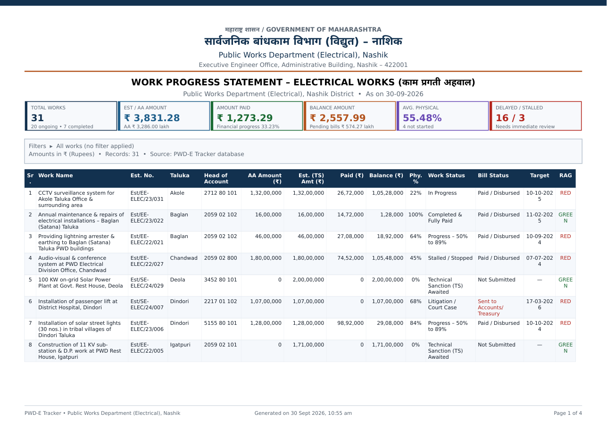
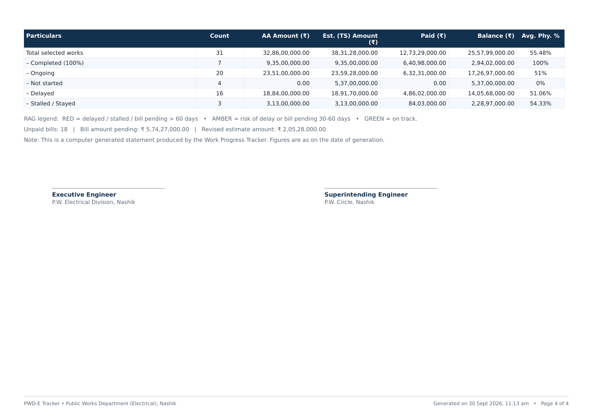
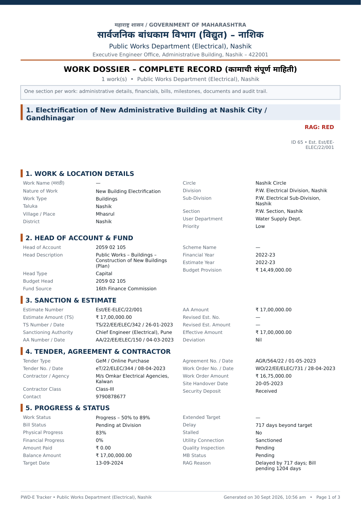
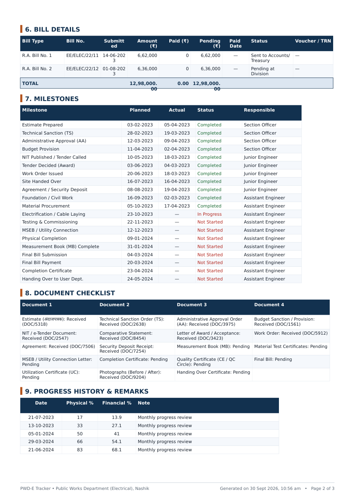
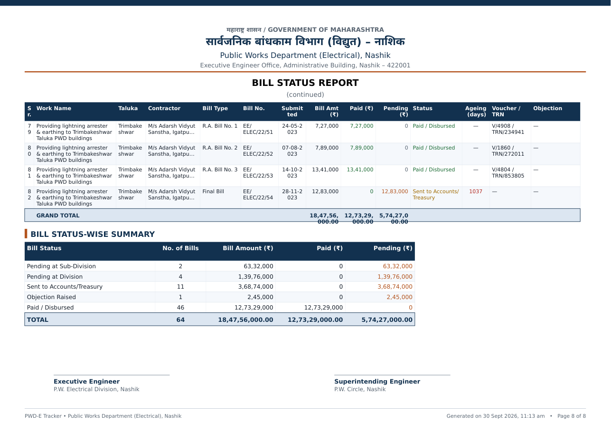

# PWD Electrical Works – Work Progress Tracker (Jalgaon)

A full-stack work-progress tracker for **Public Works Department (Electrical)** electrical works,
Jalgaon district — PWD Electrical Sub-Division Jalgaon, under P.W. Electrical Division, Dhule. Marathi + English throughout (Devanagari renders in the UI **and** in exported PDFs).

- **Stack:** Node.js 20 + Express 5 + better-sqlite3 (single-file DB) · PDFKit (PDF) · ExcelJS (Excel) · vanilla-JS SPA (no build step)
- **Run:** `cd pwd-tracker && npm install && npm start` → http://localhost:3000 (binds 0.0.0.0)
- **Database:** `data/tracker.db` (SQLite, auto-created on first run). Sample data: one click in
  Settings ▸ Data, or `POST /api/seed {"force":true}`.

## Sample report output (generated by this code)

| | |
|---|---|
|  |  |
| *Work Progress Statement — letterhead, KPI strip, taluka-grouped ledger, RAG* | *Summary table + dual signature block* |
|  |  |
| *Per-work dossier — all administrative & financial particulars* | *Dossier — bills, 20 milestones, 19-document checklist, progress history* |
|  | |
| *Bill register with ageing + status-wise summary* | |

---

## 1. What the app does

### Login & security
- **Username / password sign-in** (scrypt-hashed password, HttpOnly session cookie, 12-h sessions).
- First-run credentials: **admin / admin123** — change in **Settings ▸ Security** (a warning banner
  shows while the default password is active). Every API route and report export is behind the login.

### Data entry (you type your own works)
- **Works ▸ New Work** – full form: work name (En + Mr), Est number/year, **AA amount, Est (TS) amount**,
  revised est, **Head of Account** + head description/type/budget head, fund source, scheme, taluka /
  village / division / sub-division / section, TS & AA numbers + dates, tender/WO/contractor details,
  target dates, physical progress, paid amount, work status, bill status, priority, remarks.
- Every work automatically gets a **20-stage milestone checklist** and a **19-document checklist**
  (auto-seeded on create/import; re-seedable per work or in bulk).
- Child records per work: **bills, milestones, documents, remarks/notes, progress history** – all editable.
- **Quick update** from ledger/dashboard rows (physical %, work status, bill status, paid) – writes a
  progress-history entry automatically.
- **Bulk actions** on selected ledger rows: status, bill status, extended target, checklist seed,
  field patch, soft-delete.
- **Recycle bin** (soft delete → restore → purge), **audit log** of every write, **JSON backup/restore**.
- **Import**: paste CSV/TSV or upload .xlsx/.csv – header auto-mapping with **Marathi aliases**
  (कामाचे नाव, अंदाजपत्रक क्र., तालुका, लेखाशिर्षक, अंदाज रक्कम, प्रगती …), preview + validation,
  create/update/duplicate modes; downloadable template (`/api/import/template.csv`).

### Automation / computed fields (recompute engine)
On every save/import/restore (`POST /api/recompute` for all): effective amount, balance, financial
progress, utilisation %, **auto bill status**, unpaid bill count & pending amount, bill ageing days,
delay days vs (extended) target, **is_delayed / stalled flags**, **RAG rating** with human-readable
reason, milestone overdue/due-soon counts, document received counts. Rules (day thresholds) are
editable in Settings ▸ Rules.

### Tracking tools (views)
Dashboard KPIs + charts (taluka bar, status donut, RAG, fund utilisation, monthly progress),
Works ledger (taluka-grouped, sortable, 20+ filters incl. search/RAG/delayed/stalled/bill flags),
Work detail dossier tab-view, **Bill register** (ageing, pending, objection), **Milestone tracker**
(global, flag filters), **Alerts centre** (overdue targets, stalled, bill overdue, final-bill pending,
budget shortfall), Taluka / Head-of-account / Contractor groupings, Reports hub, Import wizard,
Settings (letterhead, rules, masters), Audit log, Help.

### Exports
- **PDF (10)**: progress statement, taluka summary, taluka×status matrix, bill status report,
  target-vs-achievement, delayed/stalled list, fund utilisation, head-wise, contractor-wise,
  milestone tracker, plus per-work **dossier** (complete record). Government letterhead
  (Marathi+English), KPI strip, RAG colours, totals, **signature block**, page x of y footers.
  Honour all filters + `?id=` / `?ids=` and `?units=lakh|rs`.
- **Excel (9)**: master ledger (live formulas, dropdowns, conditional formatting, data bars),
  taluka / head-wise / bills / targets / milestones / contractor / delay / utilisation workbooks –
  summary sheets use live `COUNTIF/SUMIF/AVERAGEIF` over the ledger.
- **CSV** of the filtered ledger (UTF-8 BOM for Excel).

---

## 2. API surface (all JSON, envelope `{ok, data?, …meta}`)

| Area | Endpoints |
|---|---|
| Works | `GET/POST /api/works`, `GET/PUT /api/works/:id`, `POST /api/works/:id/quick`, `DELETE /api/works/:id` (+`?hard=1`), `POST /api/works/:id/restore` |
| Children | `GET/POST /api/works/:id/{bills,milestones,documents,notes,progress}`, `PUT/DELETE /api/{bills,milestones,documents,notes,progress}/:id` |
| Auto | `POST /api/works/:id/milestones/auto`, `POST /api/works/:id/documents/auto`, `POST /api/recompute` |
| Bulk / bin | `POST /api/bulk`, `GET /api/recycle`, `POST /api/works/recycle/empty` |
| Analytics | `GET /api/dashboard`, `/api/alerts`, `/api/bills`, `/api/milestones`, `/api/groups/:dim`, `/api/logs` |
| Reports | `GET /api/report/pdf/:type`, `GET /api/report/excel/:type`, `GET /api/export/csv`, `GET /api/reports` |
| Import | `GET /api/import/template.csv`, `POST /api/import/preview` (file or `{text}`), `POST /api/import/commit` |
| Data | `GET /api/backup` (+`?save=1`), `GET /api/backups`, `POST /api/restore` (`{file}` or `{json,mode}`), `POST /api/seed`, `POST /api/reset` |
| Settings | `GET/PUT /api/settings` (letterhead, rules, masters), `GET /api/meta`, `GET /api/health` |

PDF types: `progress taluka_sum bills_pdf targets delays util headwise contractor milestones dossier`
Excel types: `ledger taluka_xl headwise_xl bills_xl targets_xl milestone_xl contractor_xl delay_xl util_xl`

---

## 3. Layout / code map

```
pwd-tracker/
  server.js        Express app: API routes, import engine (alias mapping, preview/commit), backup/restore
  lib/config.js    masters (talukas, heads of account, statuses…), rules, letterhead defaults, report list
  lib/db.js        SQLite schema + CRUD + recompute engine + audit log
  lib/agg.js       aggregations: filters, totals, group summaries, dashboard, alerts, bill/milestone trackers
  lib/pdf.js       PDFKit builders (Devanagari fonts, letterhead, tables, signature block)
  lib/xlsx.js      ExcelJS builders (formulas, validation, conditional formatting)
  lib/seed.js      realistic Jalgaon sample data (26 works with milestones, bills, docs, progress)
  public/          SPA: index.html, css/app.css, js/{util,charts,app}.js  (no build step)
  assets/fonts/    Noto Sans Devanagari Regular/Bold (embedded in PDFs)
  data/            tracker.db, backups/
```

## 4. Operations notes

- **The Node process caches `lib/*.js` at boot** – after editing any `lib/` file or `server.js`,
  restart the server or changes silently won't apply.
- All `works` queries use `COALESCE(is_deleted,0)=0`; numeric columns are never NULL (default 0).
- PDF money columns: whole-rupee `inr0` in wide tables, 2-dp `inr`/`lakh` where space allows –
  totals rows must fit their column width or PDFKit wraps them.
- Tests (regression harnesses used during build, re-runnable):
  `node /tmp/wtest.js` (40 API write/read assertions) and `node /tmp/spa-smoke.js`
  (jsdom boot + all routes render). Both must print 0 failed.
